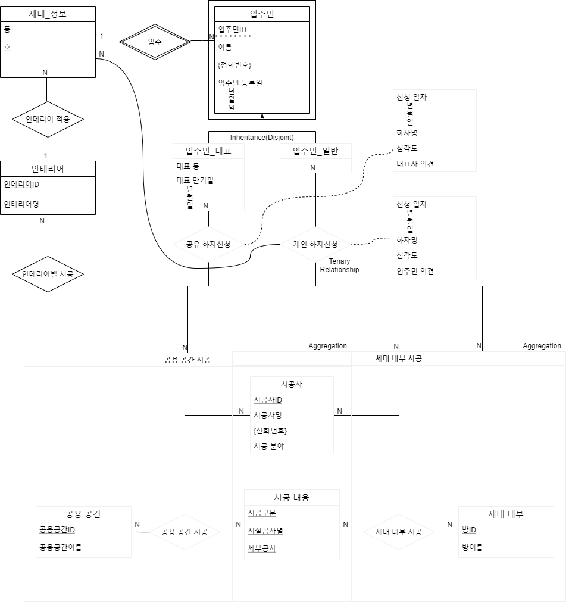

# ERD

## entity sets

### entity / 세대_정보

### entity / 인테리어

### entity / 입주민

### entity / 입주민_대표

### entity / 일반_입주민

### entity / 방

### entity / 시공사

### entity / 시설 공사

### entity / 책임 기간

## relationship sets

### relationship / 인테리어 적용

### relationship / 입주

### relationship / 인테리어별 시공

### relationship / 공유 하자신청

### relationship / 개인 하자신청

### relationship / 공용공간 시공

### relationship / 세대내부 시공

# RDB

## 세대_정보(동, 호)

## 인테리어(인테리어ID, 인테리어명)

## 시공_내용(시공구분, 시설공사별, 세부공사)

## 세대_내부(방ID, 방이름)

## 공용_공간(공용공간ID, 공용공간이름)

## 입주민(입주민ID, 이름, 등록년도, 등록월, 등록일)

## 입주민_대표(입주민ID, 대표동, 대표만기년도, 대표만기월, 대표만기일)

## 입주민전화번호(입주민ID, 전화번호)

## 시공사(시공사ID, 시공사명, 시공분야)

## 시공사전화번호(시공사ID, 전화번호)

## 인테리어(인테리어ID, 인테리어명)

## 인테리어별_시공(인테리어ID, 시공사ID, 시공구분, 시설공사별, 세부공사, 방ID)

## 공용공간_시공(공용공간ID, 시공사ID, 시공구분, 시설공사별, 세부공사)

## 세대내부_시공(방ID, 시공사ID, 시공구분, 시설공사별, 세부공사)

## 공유_하자신청(공용공간ID, 시공사ID, 시공구분, 시설공사별, 세부공사, 입주민ID, 신청년도, 신청월, 신청일, 하자명, 심각도, 대표자_의견)

## 개인_하자신청(방ID, 시공사ID, 시공구분, 시설공사별, 세부공사, 입주민ID, 신청년도, 신청월, 신청일, 하자명, 심각도, 입주민_의견)