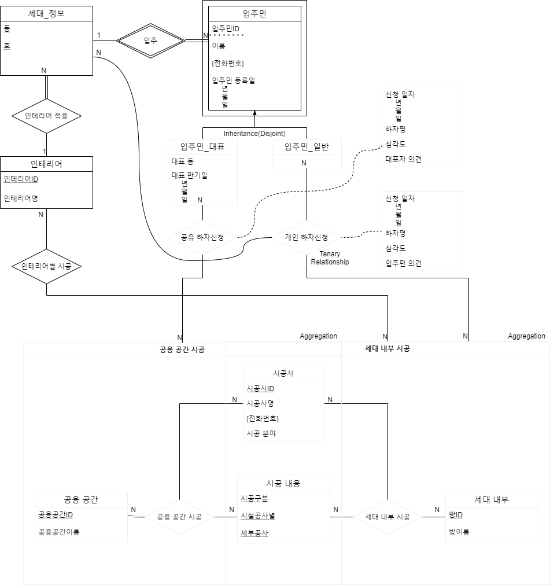

# building-defects-management-system
Building defects management system for Class : *CAU-2020-2 Database Design - Design Project*

## Notice

1. `DO NOT COPY`
2. Coded in Intellij IDEA Ultimate 2020.2 / Java
3. Used Gradle for JDBC https://gradle.org/

## Contents

1. ERD for simple building defects management system
2. ERD to RDB
3. Normalized RDB
3. JDBC sample program for system